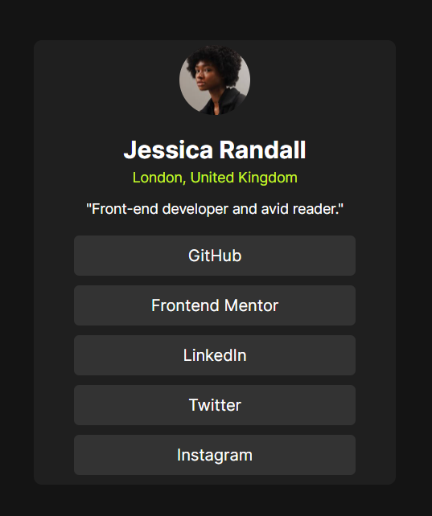

# Frontend Mentor - Social links profile solution

This is a solution to the [Social links profile challenge on Frontend Mentor](https://www.frontendmentor.io/challenges/social-links-profile-UG32l9m6dQ). Frontend Mentor challenges help you improve your coding skills by building realistic projects. 

## Table of contents

- [Overview](#overview)
  - [Screenshot](#screenshot)
  - [Built with](#built-with)
  - [Continued development](#continued-development)
- [Author](#author)

### Screenshot

### Links

- Solution URL: [Add solution URL here](http://127.0.0.1:3000/social-links-profile-main/index.html)
- Live Site URL: [Add live site URL here](https://your-live-site-url.com)

### Built with

- Semantic HTML5 markup
- CSS custom properties
- Flexbox

### Continued development
i want to continue my development on responsivness on all web browers
## Author

- Frontend Mentor - [@leo-nderson](https://www.frontendmentor.io/profile/Leo-nderson)
